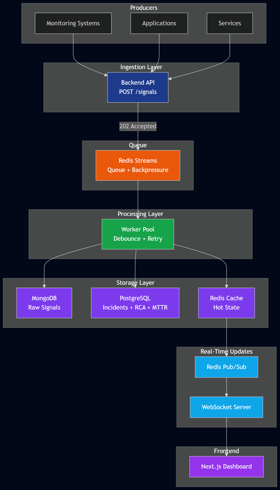

# Incident Management System (IMS)

A production-grade Incident Management System designed to handle high-throughput signal ingestion, asynchronous incident processing, and workflow-driven resolution with mandatory Root Cause Analysis (RCA).

---

## Key Features

- High-throughput signal ingestion (designed for 10,000+ signals/sec)
- Asynchronous processing using Redis Streams
- Debouncing logic (multiple signals → single incident per component)
- Mandatory RCA enforcement before incident closure
- Automatic MTTR calculation
- Real-time dashboard via WebSockets
- Backpressure-safe architecture using queue decoupling

---

## Repository Structure

```text
/backend   Fastify API, workers, workflow engine, tests
/frontend  Next.js dashboard with WebSocket updates
/infra     Docker Compose setup
/scripts   Signal simulation scripts
/docs      Architecture and design decisions
```

## Architecture



## Flow Summary
1. Signals are ingested via API and appended to Redis Streams.
2. Workers consume signals asynchronously using consumer groups.
3. Raw signals are stored in MongoDB.
4. Debouncing logic determines incident creation.
5. Incident state and RCA are stored transactionally in PostgreSQL.
6. Redis cache powers real-time dashboard updates.
7. WebSocket pushes live updates to frontend.

## Run

```bash
docker-compose up --build
```

Open:

- Dashboard: http://localhost:3000
- API health: http://localhost:4000/health

## Simulate Data

From the host after services are up:

```bash
npm install
npm run simulate --workspace backend -- burst
npm run simulate --workspace backend -- rdbms
npm run simulate --workspace backend -- cache
```

To push a larger burst:

```bash
TOTAL=50000 CONCURRENCY=500 npm run simulate --workspace backend -- burst
```

On PowerShell:

```powershell
$env:TOTAL="50000"; $env:CONCURRENCY="500"; npm run simulate --workspace backend -- burst
```

## API

`POST /signals`

```json
{
  "component_id": "checkout-api",
  "timestamp": "2026-04-30T10:00:00.000Z",
  "severity": "P1",
  "message": "latency spike over SLO",
  "metadata": { "p95_ms": 1200 }
}
```

`GET /incidents?severity=P0&component_id=checkout-api&page=1&page_size=25`

`GET /incidents/:id`

`POST /incidents/:id/rca`

`POST /incidents/:id/transition`


## Incident Lifecycle Guarantees
- Incidents follow strict state transitions: OPEN → INVESTIGATING → RESOLVED → CLOSED
- Incident cannot be CLOSED without valid RCA
- RCA must include:
  - start_time
  - end_time
  - root cause category
  - fix applied
  - prevention steps

### MTTR Calculation
```
MTTR = end_time - first_signal_time
```


## Debouncing Logic
- Signals grouped by component_id within a 10-second window
- Only one incident created per burst
- Redis locks prevent duplicate incident creation
- Subsequent signals are linked to the same incident


## Backpressure Handling

The ingestion endpoint only validates, rate-limits, and appends to Redis Streams. PostgreSQL and MongoDB writes happen in workers, so a slow database increases queue depth but does not block API intake immediately. Redis Streams preserve pending messages, and worker replicas can be scaled independently.

## Design Decisions

- Redis Streams provide the async queue.
- MongoDB stores raw signal data and query indexes.
- PostgreSQL owns incident state, RCA, and MTTR transactions.
- Redis caches active incidents and dashboard hot reads.
- State pattern centralizes lifecycle transitions.
- Strategy pattern isolates alert behavior by severity.
- Redis locks avoid duplicate incident creation under concurrent workers.

## Scaling Strategy

- Scale `backend` horizontally behind a load balancer for ingestion.
- Scale `worker` replicas for queue drain rate.
- Partition Redis Streams by component hash if one stream becomes saturated.
- Use MongoDB sharding by `component_id` for raw signal volume.
- Use PostgreSQL read replicas for dashboards and keep writes on primary.
- Replace console alert strategies with provider adapters for PagerDuty, Slack, and email.

## Tests

```bash
npm test
```

Tests cover RCA validation, debounce threshold behavior, and the signal ingestion API.


## Documentation

- [System Design](./docs/design.md) → Detailed architecture, workflows, and data flow
- [Design Decisions](./docs/decisions.md) → Rationale, trade-offs, and technology choices