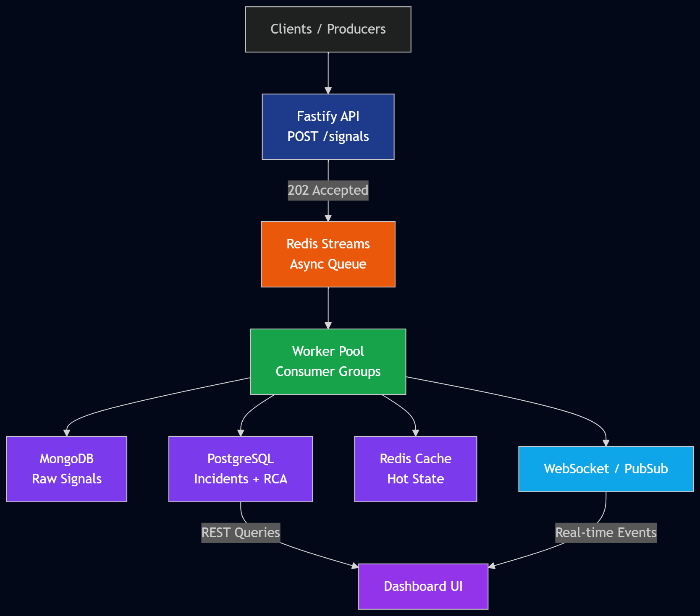

# IMS Design

## Architecture

Signals are accepted by the API and appended to a Redis Stream. Ingestion does not synchronously write PostgreSQL or MongoDB, which keeps the hot path short when storage is slow. Workers consume the stream in consumer groups, write all raw signals to MongoDB, update time-series counters, and run incident debouncing.

## Debouncing

The worker increments a Redis key scoped by `component_id` and a 10-second bucket. Only the event that reaches the threshold of 100 attempts to create an incident. A Redis `NX` lock prevents duplicate incident creation if several workers cross the boundary under contention. Existing active incidents are tracked by component in Redis and receive subsequent linked signals.

## Workflow

Incident transitions are centralized in a state machine. The valid states are `OPEN`, `INVESTIGATING`, `RESOLVED`, and `CLOSED`. Closing requires a complete RCA record in the same transaction. MTTR is computed during closure from `first_signal_time` to closure time.

## Alerting

Severity-specific strategy classes isolate notification policy:

- `P0`: pager-critical path.
- `P1`: Slack/email path.
- `P2`: log-only path.

The current implementation prints the actions so local runs are deterministic. Real providers can replace the strategies without touching the workflow.

## Backpressure

Redis Streams absorb bursts and let API requests return `202 Accepted` after queue append. Workers can scale horizontally by increasing replicas. Pending stream messages remain claimable if a worker dies. Rate limiting protects the API from unbounded producer overload.

## Data Model

MongoDB stores raw signal documents and indexes `component_id` plus `incident_id`. PostgreSQL stores transactional incident and RCA state. Redis stores active incident IDs, cached incident records, counters, locks, and pub/sub events.
